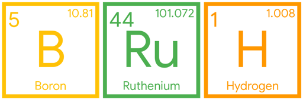
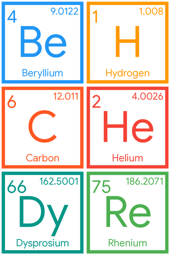

# kekmicals

This script creates simple stickers (smaller or equal to 512x512 pixels for Telegram) composed with chemical elements' symbols.

[Here](https://kekmicals.t.me/) are some example packs, with mostly Italian words.

Example:

```sh
# Create an image displaying Borum, Ruthenium and Hydrogen symbols
./kekmicals.py --style border BRuH
```

Output:



You can also use multiple words. The script will break them:

```sh
./kekmicals.py BeH CHe DyRe 
```

Output:



You can cache all of the 119 elements with `--create`:

```sh
./kekmicals.py --create # Default borderless theme
./kekmicals.py --create border
./kekmicals.py --create swap
```

This will create elements' symbols' images inside `cache/`.

You may want to test if you are able to compose a sentence without creating an output image. You can use `--test`:

```sh
./kekmicals.py --test KeK # This will raise an error, because "Ke" is not a valid element
```

---

# Credits

Thanks to [Bowserinator](https://github.com/Bowserinator) for [PeriodicTableJSON.json](https://github.com/Bowserinator/Periodic-Table-JSON/blob/master/PeriodicTableJSON.json).

This script uses [Pillow](https://pypi.org/project/pillow/).
